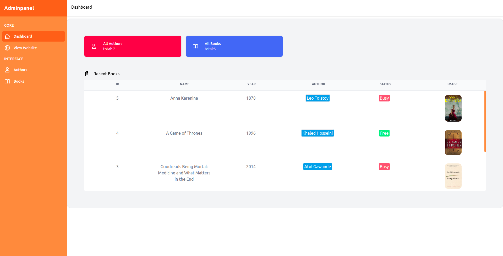

## Table of Contents

- [Table of Contents](#table-of-contents)
- [About the application](#about-the-application)
- [App looks like](#app-looks-like)
- [Prerequisites](#prerequisites)
- [Package](#package)
- [Install and Run](#install-and-run)
- [Database structure](#database-structure)
- [Resources](#resources)


<a name="about"></a>

## About the application

Library - The app is an e-library where instead of going to the library, you can search for the book you want to check if the book is busy or free, so you don't have to go to the library and come home unhappy.

## App looks like 




<a name="pre"></a>

## Prerequisites
| #                                                                                              |                                         NAME                                          | VERSION  |   Check Version    |
| :--------------------------------------------------------------------------------------------- | :-----------------------------------------------------------------------------------: | :------: | :----------------: |
|  |             <a href="https://getcomposer.org/" target=_blank>composer</a>             |  ^2.1.8  | comopser --version |
|                                  |                <a href="https://nodejs.org/en/" target=_blank>node</a>                | ^16.13.0 |      node -v       |
|                                     | <a href="https://docs.npmjs.com/cli/v8/configuring-npm/install" target=_blank>npm</a> |  ^8.7.1  |       npm -v       |
|         |         <a href="https://www.sqlite.org/index.html" target=_blank>SQLite</a>          | ^3.31.1  | sqlite3 --version  |

  


<a name="package"></a>
## Package

| name   | version    |
| ------ | ---------- |
| jquery | cdn 3.3.1  |
| ajax   | cdn 4.0.10 |


<a name="iar"></a>

## Install and Run

Downoad [ZIP](https://github.com/davitlabadze/library/archive/refs/heads/master.zip) or Clone:
 ```bash 
git clone https://github.com/davitlabadze/library.git
```


Install composer 

```bash 
composer i
```
Clone .env file
```bash
cp .env.example .env
```
Create database file
```bash
touch database/database.sqlite
```
Create key 
```bash
php artisan key:generate
```
Migrate Schema
```bash
php artisan migrate
```
Share storage link 
```bash
php artisan storage:link
```
Insert demo data on database  
```bash
php artisan db:seed
```
Install npm
```bash
npm i
```
Build App
```bash
npm run build
```

Run app 
>If the design is not as shown in the photo, open a new window(terminal or cmd or other) in the working environment and run the command  ```npm run dev```

```bash
php artisan serve
```


<a name="db"></a>

## Database structure


<a name="resources"></a>

##  Resources  

* [TailwindCss](https://tailwindcss.com/docs/guides/laravel)
* [DrawSql](https://drawsql.app/)
* [Select2](https://select2.org/)
